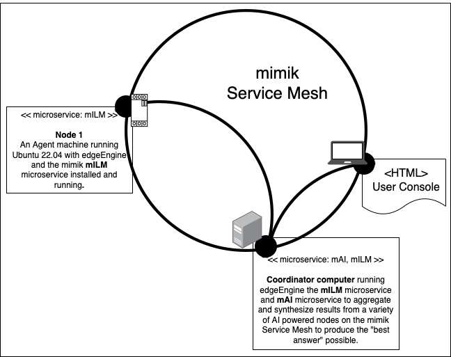

# Setting Up and Running a Single Agent Collection Scenario

The Single Agent Collection scenario is one is which the Coordinator Machine declares an Agent Collection associated that has only a single Agent Machine.

The Agent Machine has an LLM installed on it locally. The Coordinator Machine forwards the caller's prompt on the Agent Machine. The Agent Machine process the prompt and returns the response back to the Coordinator Machine. The Coordinator Machine then synthesizes the response from the Agent Machine into a "best possible response" that gets returned to the caller.

The scenario's User Console sends HTTP requests to the Coordinator Machine which then returns the information from each Agent Machine in the Agent Collection as well as the synthesized "best possible response".

Getting a Single Agent Collection up and running is a three part undertaking as follows:

* Getting a single Agent Machine up and running
* Getting the Coordinator Machine up and running
* Connecting the User Console to the Coordinator Machine via its `nodeId`.

# Getting a single Agent Machine up and running

The instructions for getting a single Agent Machine up and running are [here](agent-machine/)

# Getting the Coordinator Machine up and running

The instructions for getting the Coordinator Machine up and running are [here](coordinator-machine/)

# Connecting the User Console to the Coordinator Machine

The instructions for connecting the User Console to the Coordinator Machine are described [here](./user-console/)