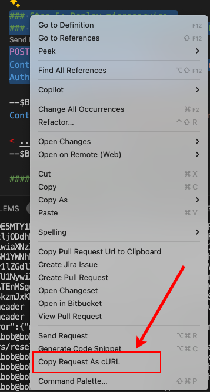

# Setting up an Agent Machine in a Single Agent Collection Scenario

The purpose of this document is to explain the steps to take to get an Agent Machine up and running in a Single Agent Collection demonstration scenario. Getting the Coordinator Machine up and running is covered later in the readme file titled, [Setting up a Coordinator Machine for a Single Agent Collection Scenario](../coordinator-machine/readme.md).

- [Setting up an Agent Machine in a Single Agent Collection Scenario](#setting-up-an-agent-machine-in-a-single-agent-collection-scenario)
- [What you need to have on hand](#what-you-need-to-have-on-hand)
- [What you'll be doing](#what-youll-be-doing)
- [Getting the Agent Machine up and running](#getting-the-agent-machine-up-and-running)
  - [Creating and configuring the .env file](#creating-and-configuring-the-env-file)
    - [Step 1](#step-1)
    - [Step 2](#step-2)
  - [Running the commands in the setup.http file](#running-the-commands-in-the-setuphttp-file)
    - [Step 1](#step-1-1)
    - [Step 2](#step-2-1)
    - [Step 3](#step-3)
    - [Step 4](#step-4)
    - [Step 5](#step-5)
    - [Step 6](#step-6)
    - [Step 7](#step-7)
    - [Step 8](#step-8)
    - [Step 9](#step-9)
    - [Step 10](#step-10)
    - [Step 11](#step-11)

# What you need to have on hand

In order to implement this scenario you will need:

* A Ubuntu 22.04 machine running the [mimOE.ai release of edgeEngine](https://github.com/mimik-mimOE/mimOE-SE-Linux/).
* The Ubuntu machine needs to have port 8083 exposed

# What you'll be doing

In this scenario, you will:

* Create and configure the `.env` with the required environment variables
* Execute the commands in the accompanying `setup.http` file according the instructions described in this document to get the Agent Machine up and running.

# Getting the Agent Machine up and running

Getting the Agent Machine up and running involves creating and configuring the `.env` that the `setup.http` uses to get its runtime information. Then, once the `.env` file is configured, you'll run the steps in the `setup.http` file. The following sections describes the details.

## Creating and configuring the .env file

Before you start configuring the `.env` file you need to have a `client Id token` and a `developer Id token` on hand. You get these tokens from the mimik Developer Console as described in a previous readme file [here](../../readme.md#getting-the-clientid-token-and-the-developerid-token). Make sure you have these tokens on hand before you continue.

Once you have the `client Id token` and a `developer Id token` on hand you are going to copy the contents of the file `env.template` into the and `.env` file that will be located in the same directory as the `setup.http` file.

### Step 1

From within the directory where this readme file is located, execute the following command in a terminaal window to copy the contents of the file `env.template` into the and `.env`.

```
cp env.template .env
```

The `.env` file will have the following content

```
# Environment variables for the Agent Machines
MODEL_URL=https://huggingface.co/lmstudio-ai/gemma-2b-it-GGUF/resolve/main/gemma-2b-it-q4_k_m.gguf?download=true
HOST_IP_ADDRESS=<IP_ADDRESS_OF_THE_AGENT_MACHINE>
CLIENT_ID=<YOUR_CLIENT_ID_TOKEN>
DEVELOPER_ID_TOKEN=<YOUR_DEVELOPER_ID_TOKEN>
API_KEY=1234
```

### Step 2

You will need to add the values for your `client Id token` and  `developer Id token` to the `.env` file according to the placeholders described above.

Also, you will need to provide the IP address of the Agent Machine that you will provision using the `setup.http`.

Once you've configured the `.env` file, run the commands in the `setup.http` file from within Visual Studio Code. (We assume you have the REST Client extension installed.) The next section describes in detail the purpose of each command.

## Running the commands in the setup.http file

The first few lines of the `setup.http` file as shown below creates the REST Client file variables that the `setup.http` file needs.
```
### Configuration 
@host=http://{{$dotenv HOST_IP_ADDRESS_IP_ADDRESS}}:8083
@developerIdToken={{$dotenv DEVELOPER_ID_TOKEN}}
@clientId={{$dotenv CLIENT_ID}}
# custom defined API KEY
@apiKey={{$dotenv API_KEY}}
```

The section that follow describes the value assigned to the `@tarName` which is the mimOE.ai microservice that will be installed on the targeted Agent Machine. Also, the section describes the artificial intelligence model that will be installed on the Agent Machine according to the file variable `@modelUrl`.

```
### Microservice
@tarName = mim-v1-1.6.0.tar

###Settings
@tokenScope=openid edge:mcm edge:clusters edge:account:associate
# Need a list of model URLs
@modelUrl={{$dotenv MODEL_URL}}
```

An explanation of each step you'll execute the `setup.http` file are described in the following sections. 

### Step 1

Step 1, as shown below, is a command that queries the edgeEngine instance running on the targeted Agent Machine to get run-time information.

**NOTE:** Step 1 will return a `nodeId` as described in a previous readme [here](../../readme.md#getting-a-nodeid). Save the `nodeId` value once it's returned. You'll need it when you are configuring the Coordinator Machine later on.

```
### Setup API's 

#### Step 1: Get Target Device Information. This call returns by the NODE_ID for the device
# @name jsonrpc
POST {{host}}/jsonrpc/v1
Content-Content-Type: application/json

{"jsonrpc": "2.0", "method": "getMe", "params": [], "id": 1}
```

### Step 2

**Step 2**, described below, returns the value for the `edgeId` token and assigns it the file variable `@edgeIdToken`. The `edgeId` token is required to get an Access Token from the edgeEngine instance running on the targeted Agent Machine.

To learn more about the purpose and use of an Access Token, read the details in the [mimik Developer Documentation](https://devdocs.mimik.com/key-concepts/03-index#accesstoken).

```
#### Step 2: Get edgeIdToken
# @name jsonrpc
POST {{host}}/jsonrpc/v1
Content-Content-Type: application/json

{"jsonrpc": "2.0", "method": "getEdgeIdToken", "params": [], "id": 1}

#### Save ID Token to a local file variable
@edgeIdToken={{jsonrpc.response.body.$.result.id_token}}
```

### Step 3

**Step 3** executes the POST command that gets an Access Token that will associated in the next step.

```
#### Step 3: Get Access Token
# @name mid
POST https://devconsole-mid.mimik.com/token
Content-Type: application/x-www-form-urlencoded

client_id={{clientId}}
&grant_type=id_token_signin
&id_token={{developerIdToken}}
&scope={{tokenScope}}
&edge_id_token={{edgeIdToken}}

#### Save Access Token to a local file variable
@edgeToken={{mid.response.body.$.access_token}}
```

### Step 4

**Step 4** associates the Access Token retrieved previously to the running instance of edgeEngine. The Access Token enables the Agent Machine to be part of the mimik Service Mesh. To learn more about the details of the mimik Service mesh, read the webpage [Understanding the edgeEngine Service Mesh](https://devdocs.mimik.com/key-concepts/06-index) in the mimik Developer Documentation.

```
#### Step 4: Associate device with account 
POST {{host}}/jsonrpc/v1
Content-Content-Type: application/json

{"jsonrpc": "2.0", "method": "associateAccount", "params": ["{{edgeToken}}"], "id": 1}
```

### Step 5

**Step 5** installs the `mILM` microservice on the targeted Agent Machine. The mILM microservice interacts with the artificial intelligence LLM that will be installed directly on the targeted Agent Machine, as described in the next step.

```
### Step 5: Deploy microservice 
POST {{host}}/mcm/v1/images
Content-Type: multipart/form-data; boundary=$Boundary$
Authorization: Bearer {{edgeToken}}

--$Boundary$
Content-Disposition: form-data; name="image"; filename="{{tarName}}"

< ../deploy/{{tarName}}
--$Boundary$--
```

### Step 6

**Step 6** is the command that verifies that the microservice is installed.

```
####  Step 6: Get Images 
GET {{host}}/mcm/v1/images
Authorization: Bearer {{edgeToken}}
```

### Step 7

**Step 7** is the command that starts the microservice on the targeted Agent Machine

```
#### Step 7: Start microservice 
POST {{host}}/mcm/v1/containers
Authorization: Bearer {{edgeToken}}

{
    "name": "mim-v1",
    "image": "mim-v1",
    "env": {
      "MCM.BASE_API_PATH": "/mim/v1",
      "API_KEY": "{{apiKey}}",
      "MCM.API_ALIAS": "true",
      "MCM.OTEL_SUPPORT": "true"
    }
}
```

### Step 8

**Step 8** verifies that the `mILM`  microservice is up and running

```
####  Step 8: Get Containers
GET {{host}}/mcm/v1/containers
Authorization: Bearer {{edgeToken}}
```

### Step 9

** Step 9** loads a model to the agent machine

**IMPORTANT:** This command must be run from within a terminal window as a `cURL` command. You'll convert the entry for Step 5 in the `setup.http` file into a `cURL` command by using the *Copy Request as cURL* feature of the VS Code Rest Client.



**BEWARE:** Typically artificial intelligence models are very large, on the order of 2 GB or more. Thus, the download will take time.

```
### Step 9: Download model (Google Gemma 2b)
### Copy as cURL because VS Code doesn't know how to handle streaming API
POST {{host}}/api/mim/v1/models
Content-Type: application/json
Authorization: bearer {{apiKey}}

{
  "id": "lmstudio-ai/gemma-2b-it-GGUF",
  "object": "model",
  "url": "{{modelUrl}}",
  "owned_by": "lmstudio-ai"
}
```

### Step 10

**Step 10** verifies that the model has been downloaded.

```
### Step 10: View deployed models 
GET {{host}}/api/mim/v1/models
Content-Type: application/json
Authorization: bearer {{apiKey}}
```

### Step 11

**Step 11** executes a prompt against the model by way of the mimik `mILM` microservice. This action verifies that the model is installed properly and is up and running.

```
##### Execute the prompt that exercises the microservice #####

### Step 11: Run the prompt that exercises the microservice
POST {{host}}/api/mai/v1/chat/completions
Content-Type: application/json
Authorization: Bearer {{apiKey}}

{
  "model": "lmstudio-ai/gemma-2b-it-GGUF",
  "messages": [ 
    { "role": "user", "content": "Who were the first 3 Presidents of the United States" }
  ], 
  "temperature": 0.7, 
  "max_tokens": -1,
  "stream": true
}
```

---

Once you've reviewed the steps described above, go to the `setup.http` file in VS Code and execute the steps.


