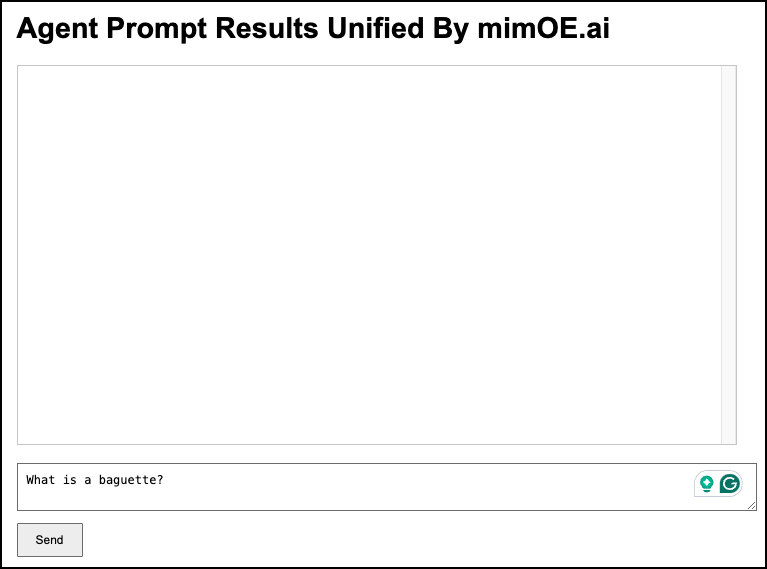

# Working with mimOE.ai User Console

# Purpose

The purpose of the page is to describe how to get the mimOE.ai User Console up and running in a Single Agent Collection scenario. The User Console allows developers to submit an AI prompt to mimOE.ai. mimOE.ai will return the "best possible result" Behind the scenes the Coordinator Machine submits the prompt to all the constituent AI Agent Machines that are running on mimOE.ai service mesh. The Coordinator Machine retrieves all the responses from the AI Agent Machines and synthesizes those responses into a "best possible response".

The illustration below is a screenshot of the User Console web page.



# System requirements

A computer running `python3` with Visual Studio Code installed.

# What you need to know before you start

In order to get full benefit from read this document we assume that you already have an Agent Machine and a Coordinator Machine up and running. Also, we assume the the Coordinator Machine has anAgent Collection named `single-agent-collection-scenario` that is composed of a single Agent Machine.

# Getting the User Console up and running

Getting the User Console up and running is a two step process. First, you need to set the IP address of the Coordinator Machine in the file named `sitedata.js`. Then second you need to start the User Console web server.

Let's start with setting the IP address of the Coordinator Machine in `sitedata.js`.

## Configuring sitedata.js

The runtime information that's required to run the User Console web site is stored in a file named `sitedata.js`. The information in the `sitedata.js` file is stored in the JSON format. The structure of the file's JSON is as follows:

```
config = {
  "API_KEY": "1234",
  "COORDINATOR_IP_ADDRESS":"<IP_ADDRESS_OF_COORDINATOR_MACHINE>",
  "AGENT_COLLECTION_NAME":"single-agent-collection"
};
```

Go to the file `sitedata.js` and change the tag `<IP_ADDRESS_OF_COORDINATOR_MACHINE>` to the IP address of the Coordinator Machine.

**Example:**

```
config = {
  "API_KEY": "1234",
  "COORDINATOR_IP_ADDRESS": "<COORDINATOR_IP_ADDRESS>",
  "AGENT_COLLECTION_NAME":"single-agent-collection"
};
```

After you've added the IP address of the Coordinator Machine to the `sitedata.js` file, start the User Console web server as described in the section that follows.


## Running the web server

After the `sitedata.js` machine has been configured, in a terminal window navigate to  `01-single-agent-architecture/user-console` directory in this project's file system.

Then in a terminal window type:

```
python3 -m http.server <OPTIONAL_PORT_NUMBER>
```

**NOTE:** The default port number on which the User Console runs is `8000`. In this case, we recommend that you run the web server against the default `8000` port number.

This command will start the User Console at the IP address of the Coordinator Machine according to the default or custom configured port number.

# Interacting with the user console

In order to operate the Use Console, enter a prompt in the text box and then click the `Send` button at the lower part of the web page. 


