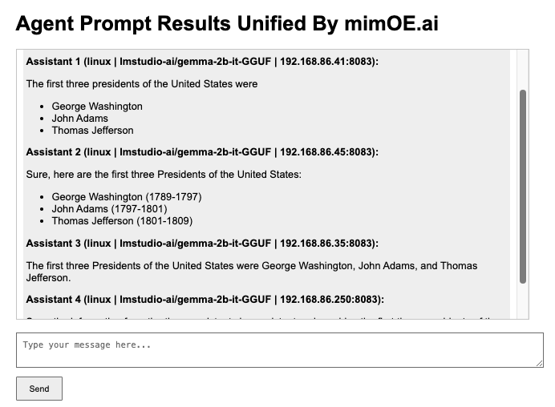

# Getting an instance of the User Console up and running for the second scenario

- [Getting an instance of the User Console up and running for the second scenario](#getting-an-instance-of-the-user-console-up-and-running-for-the-second-scenario)
- [Purpose](#purpose)
- [System requirements](#system-requirements)
- [What you need to know before you start](#what-you-need-to-know-before-you-start)
- [Getting the User Console up and running](#getting-the-user-console-up-and-running)
  - [Configuring the sitedata.js file](#configuring-the-sitedatajs-file)
  - [Running the User Console web server](#running-the-user-console-web-server)
  - [Interacting with the user console](#interacting-with-the-user-console)


# Purpose

The purpose of the page is to describe how to get the mimOE.ai User Console web server up and bound to the Agent Collection created within this scenario. As mentioned in the previous demonstration scenario, the User Console allows developers to submit an AI prompt to mimOE.ai. mimOE.ai will return the "best possible result".

Behind the scenes, the Coordinator Machine submits the prompt to all the Agent Machines in this scenario's Agent Collection. The Coordinator Machine retrieves all the responses from the Agent Machines and then unifies them into a "best possible response" that is returned to the User Console web server.

The illustration below is a screenshot of the User Console web page.



# System requirements

A computer running `python3` with Visual Studio Code installed.

# What you need to know before you start

In order to get full benefit from read this document we assume that you already have all of the Agent Machines specified in this scenario's Agent Collection running and the scenario's Coordinator Machine running, too. Also, we assume that the Agent Collection running on the Coordinator Machine is named `standard-node-nvidia-collection`.

# Getting the User Console up and running

Getting the User Console up and running is a two-step process. First, you need to configure the `sitedata.json` file with the necessary runtime information. Then you need to start the User Console web server.

## Configuring the sitedata.js file

Set the IP address of the Coordinator Machine and the name of the newly created Agent Collection in the file named `sitedata.js`. This information is stored in JSON format as follows:

---

```
config = {
  "API_KEY": "1234",
  "COORDINATOR_IP_ADDRESS": <IP_ADDRESS_OF_COORDINATOR_MACHINE>
  "AGENT_COLLECTION_NAME": "multi-agent-collection"
};
```

Here is an example of a properly configured `sitedata.js` file.

---

```
config = {
  "API_KEY": "1234",
  "COORDINATOR_IP_ADDRESS": "192.168.86.21",
  "AGENT_COLLECTION_NAME": "multi-agent-collection"
};
```

Once the `sitedata.js` file has been configured, you're ready to start the web server.

## Running the User Console web server

In a terminal window, navigate to  `03-multi-agent- [Getting an instance of the User Console up and running for the second scenario](#getting-an-instance-of-the-user-console-up-and-running-for-the-second-scenario)
- [Getting an instance of the User Console up and running for the second scenario](#getting-an-instance-of-the-user-console-up-and-running-for-the-second-scenario)
- [Purpose](#purpose)
- [System requirements](#system-requirements)
- [What you need to know before you start](#what-you-need-to-know-before-you-start)
- [Getting the User Console up and running](#getting-the-user-console-up-and-running)
  - [Configuring the sitedata.js file](#configuring-the-sitedatajs-file)
  - [Running the User Console web server](#running-the-user-console-web-server)
  - [Interacting with the user console](#interacting-with-the-user-console)


---

```
python3 -m http.server 8005
```

**NOTE:** Although the default port number on which the User Console runs is `8000`, in this case, we're going to have the web server listen on port `8005` to avoid any collision with the User Console web server started in the previous scenario.


## Interacting with the user console

In order to operate the Use Console, enter a prompt in the text box and then click the `Send` button at the lower part of the web page. 


