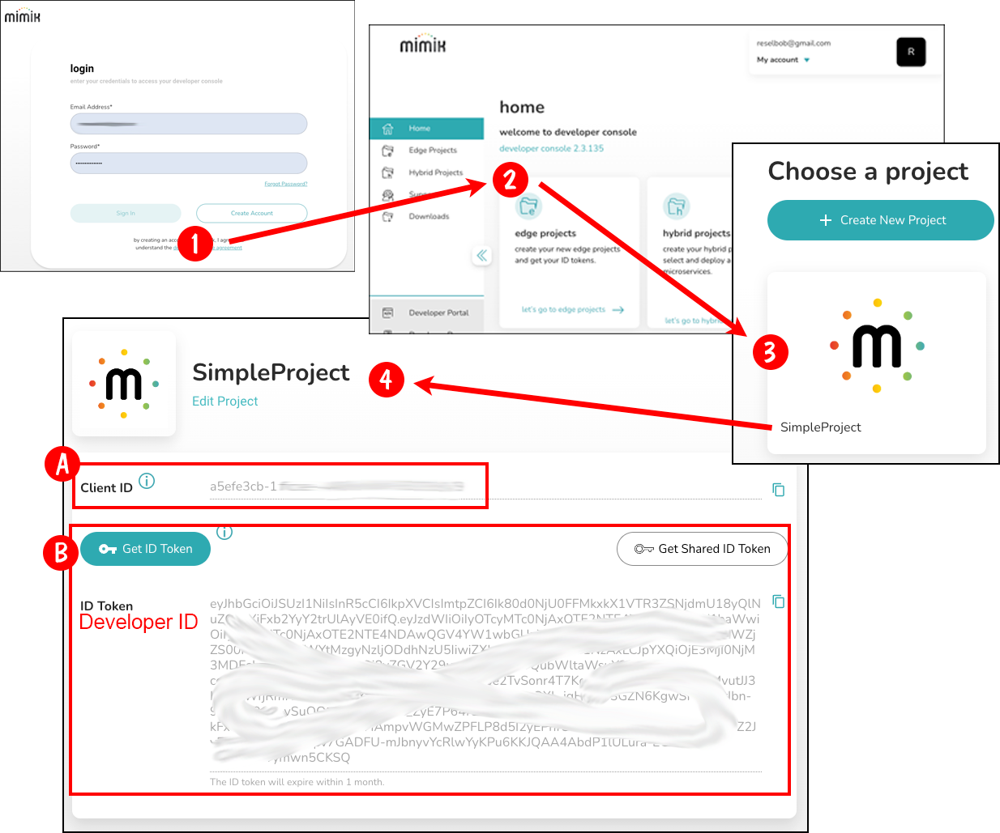

# Getting the Client ID and Developer ID tokens

You'll get the `Client_ID`and `Developer_ID` tokens from within the mimik Developer Portal. The steps are illustrated below in Figure 1. The process for getting both tokens is as follows:

1. Go to the mimik Developer Portal [here](https://console.mimik.com/).
2. Login to the Portal or create an account if you don't have one (Callout 1)
3. Click the link **let's go to edge projects** (Callout 2)
4. Create or select a project. In the case of Figure 1, the existing project is SimpleProject. (Callout 3)
5. Upon arriving at the project page (Callout 4), copy the Client ID as displayed and save it for later use. (Callout A)
6. Click the button labeled, `Get ID Token` (Callout B) to generate the Developer ID token, copy the token and save it for later use. 

||
|----|
|Figure 1: The process for getting the `Client_ID` and `Developer_ID` tokens|