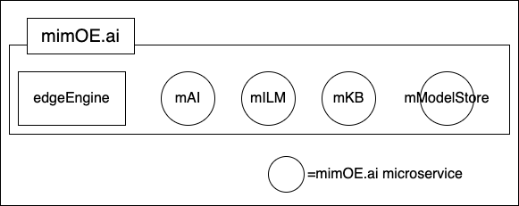

# Table of Contents

- [Table of Contents](#table-of-contents)
- [Introduction to mimOE.ai](#introduction-to-mimoeai)
  - [Welcome to mimOE.ai](#welcome-to-mimoeai)
  - [What is mimOE.ai?](#what-is-mimoeai)
  - [Key Features and Benefits of mimOE.ai](#key-features-and-benefits-of-mimoeai)
- [Core concepts and Architecture](#core-concepts-and-architecture)
  - [Understanding the Basic Architecture](#understanding-the-basic-architecture)
  - [The Nature and Use of mimOE.ai](#the-nature-and-use-of-mimoeai)
  - [AI Focused Microservices](#ai-focused-microservices)
- [Key Components](#key-components)
  - [Understanding Agent Machines](#understanding-agent-machines)
  - [Understanding the Coordinator Machine](#understanding-the-coordinator-machine)
  - [Understanding Agent Collections](#understanding-agent-collections)
- [Prerequisites](#prerequisites)
  - [What You Need to Know Before You Start](#what-you-need-to-know-before-you-start)
- [Getting Started](#getting-started)
  - [Getting Essential Configuration Information](#getting-essential-configuration-information)
    - [Getting the clientId token and the developerId token](#getting-the-clientid-token-and-the-developerid-token)
    - [Getting a nodeId](#getting-a-nodeid)
  - [Working With setup.http Files](#working-with-setuphttp-files)
- [Scenario Implementations](#scenario-implementations)
  - [What You Need to Have On Hand](#what-you-need-to-have-on-hand)
  - [Hardware and Software Recommendations](#hardware-and-software-recommendations)
  - [Implementing the Demonstration Scenarios](#implementing-the-demonstration-scenarios)
    - [Scenario 1: Setting up and running a Single Agent Collection scenario](#scenario-1-setting-up-and-running-a-single-agent-collection-scenario)
      - [Getting a single Agent Machine up and running](#getting-a-single-agent-machine-up-and-running)
      - [Loading an AI Model to the Agent Machine](#loading-an-ai-model-to-the-agent-machine)
      - [Getting the Coordinator Machine up and running](#getting-the-coordinator-machine-up-and-running)
      - [Connecting the User Console to the Coordinator's Machine](#connecting-the-user-console-to-the-coordinators-machine)
    - [Scenario 2: Setting Up and Running an Agent Collection that includes an Nvidia Agent Machine](#scenario-2-setting-up-and-running-an-agent-collection-that-includes-an-nvidia-agent-machine)
      - [Adding an Nvidia Orin Jetson Nano/AGX device as an Agent Machine](#adding-an-nvidia-orin-jetson-nanoagx-device-as-an-agent-machine)
      - [Loading an AI Model to the Nvidia Device as an Agent Machine](#loading-an-ai-model-to-the-nvidia-device-as-an-agent-machine)
      - [Declaring a new Agent Collection that includes the Nvidia machine on the Coordinator Machine](#declaring-a-new-agent-collection-that-includes-the-nvidia-machine-on-the-coordinator-machine)
      - [Connecting a second instance of the User Console web server to the Coordinator Machine](#connecting-a-second-instance-of-the-user-console-web-server-to-the-coordinator-machine)
    - [Scenario 3: Setting Up and Running a Multi-Agent Collection](#scenario-3-setting-up-and-running-a-multi-agent-collection)

# Introduction to mimOE.ai

## Welcome to mimOE.ai

Welcome to mimOE.ai, a cutting-edge product designed to revolutionize AI-powered application development. mimOE.ai is built to make developing AI applications easier, more secure, and more cost-effective. Whether you're a seasoned developer or just starting your journey in AI application development, mimOE.ai provides the tools and infrastructure you need to create powerful, distributed AI solutions.

mimOE.ai empowers developers to create sophisticated AI applications that leverage distributed computing resources, local AI models, and advanced coordination capabilities. Whether you're building a simple chatbot or a complex multi-agent AI system, mimOE.ai provides the tools and infrastructure to bring your ideas to life.

This documentation describes mimOE.ai and how it works. It provides explanations and a set of hands-on demonstration projects showing developers how to work with the technology. The demonstration projects are progressive in that each builds upon activities implemented in a previous demonstration project.

The demonstration projects illustrate three scenarios of progressive complexity. The `first scenario` you'll run is an Agent Collection with a  single agent. In the `second scenario`, you'll add an Nvidia Orin device to the mimik Service Mesh as an Agent Machine. You'll then create a new Agent Collection that includes the Agent Machine you made in the first scenario and the Nvidia Agent Machine. You’ll also make a distinctly named Agent Collection on the Coordinator Machine for this scenario. In the `third scenario`, you'll add two more Agent Machines to the mimik Service Mesh and run all under another distinctly named Agent Collection. Through these scenarios, you will learn how to fetch and upload your AI model to the agents/computing nodes (steps will be highlighted in [mModelStore microservice](https://github.com/edgeMicroservice/mModelStore))

Before discussing each scenario, a developer must understand the essential concepts and components of mimOE.ai. Once a developer understands these essentials, we'll provide the instructions for a developer to get direct hands-on experience with the scenarios via demonstration projects.

Let's start by answering the question, what is mimOE.ai?

## What is mimOE.ai?

mimOE.ai is a product intended to make developing AI-powered applications more accessible, secure, and cost-effective.

In terms of application development, mimOE.ai is organized into two parts. The first part is edgeEngine. edgeEngine is the mimik technology that is the runtime that enrolls a machine into the [mimik Service Mesh](https://devdocs.mimik.com/introduction/04-index) and provides discovery capability to other edgeEngine-enabled machines running on the mimik Service Mesh. edgeEngine is also an API gateway to the various mimik microservices running on a given machine.

The second part of mimOE.ai is the various mimOE.ai microservices that enable interaction with AI assets such as large language models (LLM) and vector databases. These assets are hosted locally on a machine running edgeEngine. These microservices are `mILM`, `mAI`, `mKB`, and `mModelStore`.

The figure below describes the various deployment units.



From a developer's point of view, the vital thing to understand about mimOE.ai is that the technology is a collection of deployment units. edgeEngine is the deployment unit that needs to be installed on any machine that implements mimOE.ai. The other deployment units are the various AI-focused microservices published by mimik, `mILM`, `mAI`, `mKB`, and `mModelStore`. You'll learn how to use these microservices in sections to come.

## Key Features and Benefits of mimOE.ai

Its key features are:

* Distributed AI processing
* Secure interactions with AI models
* Efficient coordination of multiple AI agents
* Support for local LLMs and vector databases
  
The main benefits are:

* Faster AI application development
* Enhanced security for AI interactions
* Improved accuracy through multi-agent processing
* Cost-effective utilization of computing resources
* Supports various computing devices, from standard computers to mobile devices and AI-optimized hardware like NVIDIA GPUs.

# Core concepts and Architecture

## Understanding the Basic Architecture

Under mimOE.ai, two types of machines are running on a mimik Service Mesh. One machine is a Coordinator Machine. The  other machine is an Agent Machine. As mentioned above, mimOE.ai has a feature that will process prompt results from various AI prompts and synthesize those prompt results into a "best possible response". The Coordinator Machine does the work of gathering the prompt results into a "best possible response". The Agent Machine(s) executes a particular prompt against an LLM or vector database that gets processed upstream by a Coordinator Machine.

The figure below shows an instance of the mimik Service Mesh with four Agent Machines and a Coordinator Machine.


A computing device is deemed an Agent machine when it runs one of the mimOE.ai microservices, `mILM`, `mKB`, or `mModelStore`. These microservices are intended to execute direct prompt interactions with an LLM or vector database.

A computing device is deemed a Coordinator Machine when it runs the `mAI` microservice.

**NOTE:** It is possible for a computing device to be both an Agent Machine and a Coordinator Machine. However, this capability is an advanced topic beyond the scope of this introductory documentation.

## The Nature and Use of mimOE.ai

mimOE utilizes mimik's edgeEngine runtime and mimik Service Mesh to enhance artificial intelligence processing capabilities in application development. Using mimOE.ai a developer can interact with LLMs that run directly on any number of computing devices. Such devices can be a standard computer on a developer machine, a server in a data center, a mobile device such as a cell phone or tablet, or hardware optimized for AI processing such as those computing devices manufactured by Nvidia.

## AI Focused Microservices

mimOE publishes several microservices that execute under the edgeEngine runtime on a given computing device. These microservices are:

|Microservice|Description||
|----|----|----|
|mILM|A microservice that exposes a discoverable API interacting with an LLM. The implementation can either be done by exposing an API of an LLM that runs in the same process or acting as a proxy for an LLM that runs in a different process and exposes a non-discoverable API.|Go to the release page [HERE](https://github.com/edgeMicroservice/mILM)|
|mAI (aka mAIChain)|An implementation of an AI chain as a microservice. mAI acts as a coordination agent in a collection of AI agents that perform specific tasks. mAI has no hardware constraints and can run on machines that also run other agents. There can be more than one mAI per collection of agents; mAI defines a specific goal when dealing with multiple agents. When the AI chain is well-defined, it is possible to have a configuration-based microservice. However, when dealing with complex interactions, the mAI will have a specific code to implement the AI chain.|Go to the release page [HERE](https://github.com/edgeMicroservice/mAI)|
|mKB|A microservice that uses a vector database to implement an augmented generation system. Documents are chunked and indexed by creating vector representations (embeddings) of the document. The result of the indexation is stored in a vector database. mKB is used in a collection of agents as an agent that has specific knowledge about a subject|Go to the release page [HERE](https://github.com/edgeMicroservice/mKB)|
|mModelStore|A microservice that stores AI models and exposes discoverable API to allow other components (mILM, for example) to fetch the model for its consumption. The component that fetches the model can be on the same machine or a different machine.|Go to the release page [HERE](https://github.com/edgeMicroservice/mModelStore)|
| mInsight|A microservice that allows a developer to access the context in which the node running mInsight is. It provides insights into AI agents’ interactions and their operating context. The context is based on three scopes: network, proximity, and account, and it contains the list of nodes with their attributes and the microservices (mKB, mAI, mILM, mModelStore, and others) running on each node.|Go to the release page [HERE](https://github.com/edgeMicroservice/mInsight)|

In short, mimOE.ai's enhancements make working with AI faster, more secure, and more accurate.

# Key Components

## Understanding Agent Machines

As mentioned, an Agent Machine executes a prompt against a particular LLM or vector database. The figure below illustrates the logic that describes how an Agent Machine works. An explanation of the illustration follows.


The starting point for interacting with an Agent Machine is a prompt submitted to the edgeEngine runtime web server at port 8083. EdgeEngine passes the prompt onto the mimOE.ai microservice, which interacts with a particular AI model. If the Agent Machine runs the `mILM` microservice, it will access LLM stored locally on the machine. The Agent Machine will interact with a vector database if it runs the `mKB` microservice. If the Agent Machine runs the `mModelStore` microservice, it will interact with an AI model running elsewhere.

Once the AI model processes the prompt, the result is returned to the mimOE.ai microservice and then returned to the caller who submitted the prompt.

Working with an Agent Machine is covered in [a section to come](#getting-a-single-agent-machine-up-and-running).

## Understanding the Coordinator Machine

As mentioned above, the role of the Coordinator Machine is to synthesize prompt responses from many Agent Machines into a "best possible response". The figure below illustrates the logic of a Coordinator Machine. The details about the illustration follow.


The Coordinator Machine is intended to support multi-agent processing.

The way that multi-agent processing works is that a user submits, via the edgeEngine runtime, a prompt to the Coordinator Machine according to a specific Agent Collection. (The details about an Agent Collection are discussed in the coming section.) The Coordinator Machine forwards the prompt to the Agent Machines in the Agent Collection. Each Agent Machine in the Agent Collection processes the prompt and returns its response to the Coordinator Machine. The Coordinator Machine then synthesizes the prompt responses from the Agent Machines into the "best possible answer."

Working with a Coordinator Machine is covered in [a section to come](#getting-the-coordinator-machine-up-and-running).

## Understanding Agent Collections

An Agent Collection is a logical grouping of Agent Machines according to the model(s) running on the given machine. It is a named organizational unit. Thus, an Agent Collection is identified on a Coordinator Machine according to its name. The figure below describes various Agent Collections in force in the demonstration scenarios.


A mimOE.ai Coordinator Machine is designed to support multiple Agent Collections. You'll cover the specifics of creating and naming an Agent Collection when you do the hands-on demonstration scenarios that will follow.

Also, as you'll learn when you start working with the various demonstration scenarios, you'll bind an instance of the User Console to a given Agent Collection on a Coordinator Machine according to the Coordinator Machine's IP address and the name of the Agent Collection of interest installed on the Coordinator Machine.

# Prerequisites

## What You Need to Know Before You Start

To get full benefit from reading this documentation, you need to have the following before you start:

* A mimik developer's account, which you create on the [Getting Started page of the mimik Developer Portal](https://console.mimik.com/create_account). (See the following figure.)

* A general understanding of mimik technology because mimOE.ai is an extension. The following links refer to entries in the [mimik Developer Documentation](https://devdocs.mimik.com/) that describe the basics of mimik.
  * [Introduction to edgeEngine](https://devdocs.mimik.com/introduction): Introduces a developer to the 3 essential components of edgeEngine technology: the edgeEngine Runtime, the hybrid edgeCloud, and the edgeEngine Service Mesh.
  * [Key Concepts](https://devdocs.mimik.com/key-concepts): Describes the key concepts a developer needs to understand to work effectively with edgeEngine.

In addition to understanding the basics of mimik technology, a developer needs to understand the nature of large language models (LLM) and how they respond to prompts and queries submitted by end-users. LLMs are important part of mimOE.ai

# Getting Started

## Getting Essential Configuration Information

To get the various devices within the mimik Service Mesh integrated into mimOE.ai at run time, a developer must have information about the developer's account on the [mimik Developer Portal](https://console.mimik.com/). Also, the developer will need to discover information about the machine running on the mimik Service Mesh, which is intended to be part of the demonstration scenario. The required information is:

* `clientId token`
* `developerId token`
* `nodeId`

The sections that follow describe the details of the required information listed above.

### Getting the clientId token and the developerId token

The figure below describes the steps necessary to get the `clientId token` and `developerId token` from the [mimik Developer Portal](https://console.mimik.com/). A developer will navigate to the Developer Portal and do the steps described in the figure below according to the callout numbers in the illustration.


### Getting a nodeId

A `nodeId` is an alphanumeric string associated with a particular machine running on the mimik Service Mesh. The `nodeId` is assigned at runtime by the edgeEngine instance running on the given machine. A developer discovers the `nodeId` of the given machine by running a cURL command against the IP address of the machine in question.

```
curl --request POST \
  --url http://<MACHINE_IP_ADDRESS>:8083/jsonrpc/v1 \
  --header 'content-content-type: application/json' \
  --header 'user-agent: vscode-restclient' \
  --data '{"jsonrpc": "2.0", "method": "getMe", "params": [], "id": 1}'
```

The cURL command will return a result similar to the following:

```
HTTP/1.1 200 OK
Access-Control-Allow-Methods: GET, POST, DELETE, PUT, OPTIONS
Access-Control-Allow-Origin: *
Connection: close
Content-Length: 342
Content-Type: application/json
Date: Sat, 10 Aug 2024 16:23:07 GMT

{
  "id": 1,
  "jsonrpc": "2.0",
  "result": {
    "accountId": "d4011bb5-81dd-4011-9471-d76b56e001d7__2972174601916518400",
    "linkLocalIp": "192.168.86.41",
    "name": "pi3",
    "nodeId": "85513d8f180efd7d645af637a2278081097b60ecba3c48cbf615aed9",
    "supernodeTypeName": "_mk-v15-4996e4c2442cc796f2c0ddb4e5e1627d._tcp",
    "version": "v3.11.0.ml.71.g577be1f5 (developer edition)"
  }
}
```

The `nodeId` is the value of the `result.nodeId` property in the JSON data returned by the cURL command.

Also, a developer can discover a machine's `nodeId` by running a specific command from within the `setup.http` file that provisions a particular machine. The next section discusses using a [VS Code REST Client extension](https://marketplace.visualstudio.com/items?itemName=humao.rest-client) `setup.http` file.


## Working With setup.http Files

The hands-on demonstration scenarios described in the documentation use the [VS Code REST Client extension](https://marketplace.visualstudio.com/items?itemName=humao.rest-client) to execute cURL commands automatically. The commands are defined and executed within a file named `setup.http`. There will be various `setup.http` files used throughout the demonstration scenarios. There will be `setup.http` files to provision and exercise Agent Machines. Also, there will be `setup.http` files intended to provision and exercise Coordinator Machines. (The nature and use of Agent and Coordinator Machines were described in earlier sections.) 

The critical thing to understand about `setup.http` files is that they are intended to make executing commands on a machine in the mimik Service Mesh easier and less error-prone. Also, it's important to understand that each `setup.http.` file will have a particular `.env` file associated with it. The `.env` file defines the environment variables that provide runtime information that the `setup.http` file needs to execute  properly the commands against its intended machine. For example, the values for `HOST_IP_ADDRESS`, `DEVELOPER_ID_TOKEN`, `CLIENT_ID`, and `API_KEY` shown in the snippet of the `setup.http` file shown below are defined as environment variables within the associated `.env` file.


Developers will generate and configure `.env` files when performing the hands-on demonstration scenarios described in this documentation. Typically, `.env` files will be created automatically against a template file using a bash script.

# Scenario Implementations

## What You Need to Have On Hand

When it comes time to do the hands-on demonstration projects, you'll need to have the following:

* A development machine running a copy of Visual Studio Code
* The [Rest Client extension](https://marketplace.visualstudio.com/items?itemName=MadsKristensen.RestClient) installed in Visual Studio code
* Working familiarity using the Rest Client. (Read [this tutorial](https://medium.com/lseg-developer-community/how-to-test-rest-api-with-visual-studio-code-rest-client-extensions-9f2e061d0299) to get a basic understanding of how to use the Rest Client.)
* A set of computers running the Ubuntu 22.04 with port 8083 exposed. These computers can be distinct physical AMD and ARM, such as Raspberry Pi or AMD virtual machines (VM) running Ubuntu 22.04. Also, these computers must be running the latest version of edgeEngine for mimOE.ai. This is a version of edgeEngine formally called `mimOE-SE-Linux v3.12.0` and can be downloaded from the [mimOE-SE-Linux v3.12.0 Release Page on GitHub](https://github.com/mimik-mimOE/mimOE-SE-Linux/).

## Hardware and Software Recommendations

As mentioned previously, for demonstration and education purposes, you will create three scenarios of increasing complexity progressively. Each scenario builds on concepts and work done in the previous scenario.

To review, these scenarios are:

* **Scenario 1:** A single [Agent Machine](#understanding-agent-machines) and a [Coordinator Machine](#understanding-the-coordinator-machine).
* **Scenario 2:** This is a Two-Agent Machine scenario that includes an Nvidia device that runs under the Coordinator created in Scenario 1.
* **Scenario 3:** A multiple Agent Machine scenario that runs under the Coordinator Machine created in Scenario 1.

(The details about the nature and use of an Agent Machine and a Coordinator Machine are described in the section [Understanding the Basic Architecture](#understanding-the-basic-architecture) that follows later on in this document.)
  
These demonstration scenarios involve running several computers on the mimik Service Mesh. These computers will need to run the latest edgeEngine version for mimOE.ai.

For `Scenario 1`, we recommend using an AMD computer for the Coordinator Machine and an ARM or AMD computer for the single Agent Machine.

In `Scenario 2,` we demonstrate incorporating an Nvidia Orin Jetson Nano device into the mimik Service Mesh. So, you will actually need one available. In Scenario 2, you will use the existing Coordinator Machine you created in Scenario 1.

In `Scenario 3`, you will add two more Agent Machines to the mimik Service Mesh and configure mimOE.ai to support the additional AMD or ARM computers.


The table below describes the machine and releases of mimOE-SE-Linux v3.12.0 that you will need to have available for each scenario.

|Scenario|Machine|Type|Version of mimOE-SE-Linux|
|:---------|----|----|----|
|Scenario 1|Coordinator Machine|ARM or AMD|Click to download: [mimOE-SE-linux-developer-AMD64-v3.12.0.tar](https://github.com/mimik-mimOE/mimOE-SE-Linux/releases/download/v3.12.0/mimOE-SE-linux-developer-AMD64-v3.12.0.tar) or [mimOE-SE-linux-developer-ARM64-v3.12.0.tar](https://github.com/mimik-mimOE/mimOE-SE-Linux/releases/download/v3.12.0/mimOE-SE-linux-developer-ARM64-v3.12.0.tar)|
| |Agent Machine|ARM or AMD|mimOE-SE-linux-developer-AMD64-v3.12.0.tar or mimOE-SE-linux-developer-ARM64-v3.12.0.tar|
|Scenario 2|Existing Coordinator Machine|Installed in Scenario 1| |
| |Agent Machine|Installed in previous in Scenario 1| |
| |Agent Machine|Nvidia Orin Jetson Nano device| Click to download: [mimOE-SE-linux-developer-ARM64-CUDA-v3.12.0.tar](https://github.com/mimik-mimOE/mimOE-SE-Linux/releases/download/v3.12.0/mimOE-SE-linux-developer-ARM64-CUDA-v3.12.0.tar)|
|Scenario 3|Existing Coordinator Machine|Installed in Scenario 1| |
| |Agent Machine|Installed in Scenario 1| |
| |Agent Machine|Nvidia Orin Jetson Nano device installed in Scenario 2| |
| |Agent Machine|ARM or AMD|mimOE-SE-linux-developer-AMD64-v3.12.0.tar or mimOE-SE-linux-developer-ARM64-v3.12.0.tar|
| |Agent Machine|ARM or AMD|mimOE-SE-linux-developer-AMD64-v3.12.0.tar or mimOE-SE-linux-developer-ARM64-v3.12.0.tar|

The details of each release, as well as Quickstart instructions for installation, are located at [the mimOE-SE-Linux-v3.12.0 Release page](https://github.com/mimik-mimOE/mimOE-SE-Linux/releases) on GitHub.

## Implementing the Demonstration Scenarios

The `first scenario` you'll run is a single-agent scenario under Agent Collection.

In the `second scenario`, you'll add an Nvidia Orin device to the mimik Service Mesh as an Agent Machine. You'll then create a new Agent Collection that includes the Agent Machine you created in the first scenario and the Nvidia Agent Machine. For this scenario, you’ll also make a distinctly named Agent Collection on the Coordinator Machine.

In the `third scenario`, you'll add two more Agent Machines to the mimik Service Mesh and run all under another distinctly named Agent Collection.

### Scenario 1: Setting up and running a Single Agent Collection scenario

The Single Agent scenario is one in which the Agent Collection associated with the Coordinator Machine has only a single Agent Machine. The Coordinator Machine works with that machine in the Agent Collection; forwarding prompts the Coordinator Machine to synthesize. The User Console sends HTTP requests to the Coordinator Machine and receives prompt responses from the Agent Machine. The Coordinator Machine then synthesizes these responses.


Getting a single Agent Collection up and running is a three-part undertaking as follows:

* Getting a single Agent Machine up and running
* Getting the Coordinator Machine up and running
* Connecting the User Console to the Coordinator Machine via its `nodeId`.

#### Getting a single Agent Machine up and running

The instructions for getting a single Agent Machine up and running are [here](01-single-agent-architecture/agent-machine/)

#### Loading an AI Model to the Agent Machine

The instructions for loading an AI model to the Agent Machine are [here](01-single-agent-architecture/agent-machine/readme.md#Step-9)

#### Getting the Coordinator Machine up and running

The instructions for getting the Coordinator Machine up and running are [here](01-single-agent-architecture/coordinator-machine/)

#### Connecting the User Console to the Coordinator's Machine

The instructions for connecting the User Console to the Coordinator Machine are described [here](01-single-agent-architecture/user-console/).

---

### Scenario 2: Setting Up and Running an Agent Collection that includes an Nvidia Agent Machine

**NOTE:** This demonstration scenario will only be implemented after completing the first scenario, demonstrating how to use mimOE.ai to work with a single Agent Collection.

---

In this scenario, you will add an Nvidia Orin Jetson Nano/AGX device to the mimik Service Mesh. Then, you will configure that NVidia device to be an Agent Machine. After the Nvidia Orin Jetson Nano/AGX device is up and running, you create a new, distinctly named Agent Collection on the existing Coordinator Machine, including the Agent Machine made in the previous demonstration scenario and the newly created NVidia Agent Machine.

After all the Service Machines are up and running and the Coordinator Machine has been configured with the new Agent Collection, you'll implement an instance of the User Console web server that listens on a distinct port. This latest User Console web server instance will be bound to the newly created Agent Collection with the previously created Agent Machine and the freshly created Nvidia Agent Machine.

The figure below shows the demonstration scenario you'll be able to implement.


#### Adding an Nvidia Orin Jetson Nano/AGX device as an Agent Machine

To learn how to add an Nvidia Orin Jetson Nano/AGX device as an Agent Machine on the mimik Service Mesh, go [here](./02-nvidia-architecture/nvidia-agent-machine/).

#### Loading an AI Model to the Nvidia Device as an Agent Machine

To learn how to load an AI model to the Agent Machine, go [here](./02-nvidia-architecture/nvidia-agent-machine/readme.md#Step-9).

#### Declaring a new Agent Collection that includes the Nvidia machine on the Coordinator Machine

To learn how to update the Coordinator Machine created in the last scenario with an additional Agent Collection that includes the newly added NVidia Agent Machine, go [here](./02-nvidia-architecture/coordinator-machine/).

#### Connecting a second instance of the User Console web server to the Coordinator Machine

To learn how to create a second instance of the User Console web server that connects to the Coordinator Machine with the new Agent Collection and the Nvidia device, go [here](./02-nvidia-architecture/user-console/).

----

Please follow the instructions for setting up and using the new Agent Collection, which includes the NVidia Agent Machine, before proceeding to the following scenario.

### Scenario 3: Setting Up and Running a Multi-Agent Collection

This scenario enhances the previous one. In this scenario, you will add two more Agent Machines running edgeEngine to the mimik Service Mesh. Each machine will run the `mILM` microservice. Also, each machine will have an LLM loaded directly on it. The model is the same one configured and used on the single Agent Machine in the previous scenario.


After you have the two additional Agent Machines up and running, you will return the Coordinator Machine and define an additional Agent Collection that will include both the Agent Machine provisioned in the previous scenario and the Nvidia Agent Machine.

Finally, you will configure and run an additional User Console web server instance bound to the new Agent Collection you created on the Coordinator Machine. This additional User Console web server will listen on a new, distinct port.

As in the demonstration scenario executed previously, getting a Multi-Agent Collection up and running is a three-part undertaking as follows:

* Getting two additional Agent Machines up and running
* Configuring the Coordinator Machine to support an additional Agent Collection that includes the new Agent Machines and those Agent Machines created previously.
* Connecting a new instance of User Console to the Coordinator Machine via its nodeId. The new instance of the User Console web server for this scenario will run on a new distinct port and will be bound to the Agent Collection created in this demonstration scenario.

To learn the details of getting Scenario 3 up and running go [HERE](03-multi-agent-architecture/README.md).

